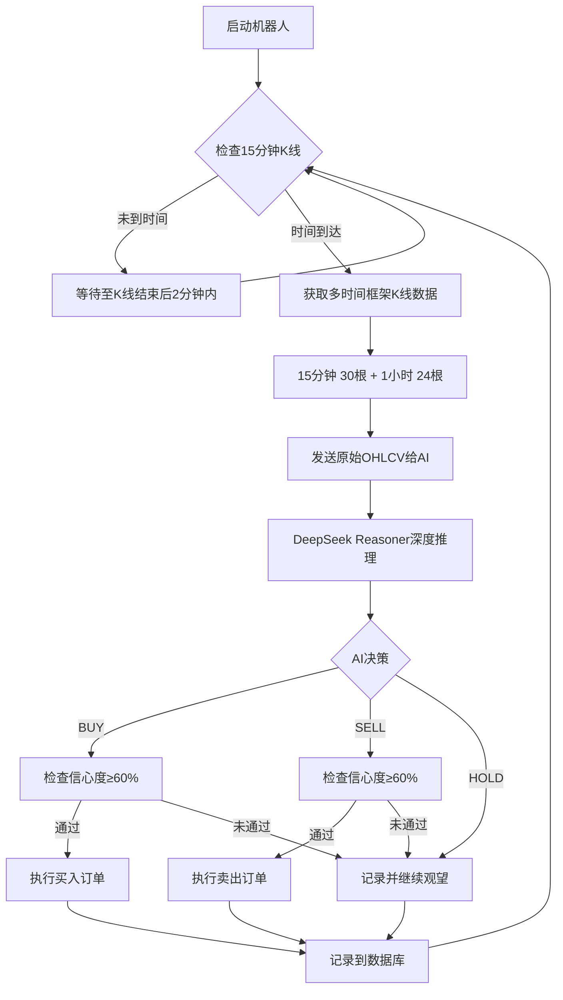

# 🤖 OKX AI 自动交易机器人

<div align="center">

**基于 DeepSeek Reasoner 的比特币智能交易系统**

[](https://www.python.org/)
[](LICENSE)
[](https://www.okx.com/)
[](https://platform.deepseek.com/)

一个使用 DeepSeek Reasoner AI 分析市场并在 OKX 交易所自动交易 BTC 的智能系统

[特性](#-特性) • [快速开始](#-快速开始) • [配置](#-配置说明) • [部署](#-部署方式) • [常见问题](#-常见问题)

</div>

---

## ✨ 特性

### 核心功能
- 🧠 **AI 驱动决策** - 使用 DeepSeek Reasoner 模型深度推理市场趋势
- 📊 **多时间框架分析** - 综合 15分钟 和 1小时 K线数据
- 🎯 **智能风控** - AI 自主决定交易量、止盈止损位
- ⚡ **K线对齐执行** - 在 15 分钟 K线结束后精准执行
- 📈 **实时监控面板** - Web 界面查看交易状态和历史
- 💾 **完整记录** - SQLite 数据库记录所有交易和决策

### 技术亮点
- **原始K线分析**: 直接发送 OHLCV 数据给 AI，让模型自主发现价格模式
- **推理模型优化**: 专为 DeepSeek Reasoner 优化的精简提示词
- **模拟盘支持**: 先在模拟环境充分测试，无需真金白银
- **Docker 部署**: 一键启动，支持容器化部署
- **Web API**: FastAPI 提供 RESTful 接口

---

## 📁 项目结构

```
okx/
├── bot/                    # 核心交易逻辑
│   ├── trader.py          # OKX 交易执行器（K线获取、下单）
│   ├── ai_analyzer.py     # DeepSeek AI 分析器
│   ├── strategy.py        # 止盈止损策略
│   ├── database.py        # SQLite 数据库操作
│   └── logger.py          # 日志系统
│
├── api/                   # Web API 服务
│   └── main.py            # FastAPI 应用
│
├── web/                   # 前端监控面板
│   └── index.html         # 单页应用（原生 HTML/CSS/JS）
│
├── data/                  # 数据持久化
│   ├── trading_simulated.db  # 模拟盘数据库
│   └── trading_live.db        # 实盘数据库
│
├── logs/                  # 日志文件
│   ├── trading_YYYYMMDD.log      # 交易日志
│   └── ai_decisions_YYYYMMDD.log # AI 决策日志
│
├── config.py              # 配置管理
├── run.py                 # 机器人主程序
├── requirements.txt       # Python 依赖
├── .env.example          # 环境变量模板
├── Dockerfile            # Docker 镜像
├── docker-compose.yml    # Docker 编排
└── README.md             # 项目文档
```

---

## 🚀 快速开始

### 前置要求
- Python 3.8+
- OKX 账户（[注册链接](https://www.okx.com/)）
- DeepSeek API Key（[获取链接](https://platform.deepseek.com/)）

### 1️⃣ 克隆项目

```bash
git clone <your-repo-url>
cd okx
```

### 2️⃣ 安装依赖

```bash
pip install -r requirements.txt
```

**主要依赖**:
```
python-okx==1.4.0      # OKX 官方 Python SDK
openai==1.59.5         # OpenAI 兼容客户端（用于 DeepSeek）
fastapi==0.115.6       # Web API 框架
uvicorn==0.34.0        # ASGI 服务器
python-dotenv==1.0.1   # 环境变量管理
requests==2.32.3       # HTTP 客户端
```

### 3️⃣ 配置环境变量

```bash
# Windows
copy .env.example .env

# Linux/Mac
cp .env.example .env
```

编辑 `.env` 文件，填入你的 API 密钥：

```env
# OKX API（必填）
OKX_API_KEY=your_okx_api_key_here
OKX_SECRET_KEY=your_okx_secret_key_here
OKX_PASSPHRASE=your_okx_passphrase_here
OKX_SIMULATED=true  # ⚠️ 建议先用模拟盘测试

# DeepSeek API（必填）
DEEPSEEK_API_KEY=your_deepseek_api_key_here

# 交易限制
MAX_TRADING_AMOUNT=0.01    # 单次最大 0.01 BTC
MAX_POSITION_PERCENT=30    # 最大仓位 30%
AI_MIN_CONFIDENCE=60       # 最低信心度 60%
```

> 💡 **获取 API 密钥**:
> - **OKX**: 登录 → 用户中心 → API 管理 → 创建 API（需开启"交易"权限）
> - **DeepSeek**: 访问 [platform.deepseek.com](https://platform.deepseek.com) → API Keys

### 4️⃣ 运行机器人

**Windows**:
```bash
start.bat
```

**Linux/Mac**:
```bash
python run.py
```

**仅启动 Web 面板**:
```bash
python api/main.py
# 访问 http://localhost:8000
```

---

## ⚙️ 配置说明

### 核心参数

| 参数 | 说明 | 默认值 | 推荐值 |
|------|------|--------|--------|
| `OKX_SIMULATED` | 模拟盘/实盘 | `true` | 先 `true` 测试 |
| `TRADING_SYMBOL` | 交易对 | `BTC-USDT` | - |
| `MAX_TRADING_AMOUNT` | 单次最大 BTC 数量 | `0.01` | 根据资金量 |
| `MAX_POSITION_PERCENT` | 最大仓位百分比 | `30` | 20-50 |
| `MAX_STOP_LOSS_PERCENT` | 最大止损百分比 | `5.0` | 3-5 |
| `MIN_TAKE_PROFIT_PERCENT` | 最小止盈百分比 | `1.0` | 1-3 |
| `AI_MIN_CONFIDENCE` | AI 最低信心阈值 | `60` | 60-80 |

### 高级配置

```env
# 调试模式
DEBUG_MODE=false           # true=控制台显示完整 AI 推理
LOG_AI_DECISIONS=true      # 记录所有 AI 决策（包括 HOLD）

# 网络代理（如需访问 DeepSeek）
USE_PROXY=false
HTTP_PROXY=http://127.0.0.1:7890
HTTPS_PROXY=http://127.0.0.1:7890

# Web 面板
WEB_PORT=8000
PANEL_TOKEN=               # 留空=无需密码，填写后需 token 访问
```

---

## 🔧 工作原理

### 执行流程



### 关键特性

1. **K线对齐执行**: 在每个 15 分钟 K线结束后 2 分钟内执行（如 00:02, 00:17, 00:32）
2. **原始数据分析**: 不预计算技术指标，让 AI 直接分析 K线 OHLCV 数据
3. **AI 自主决策**: AI 决定交易量、止盈止损位，不受固定规则限制
4. **多重确认**: 信心度低于 60% 时拒绝交易

---

## 📊 监控面板

访问 `http://localhost:8000` 查看实时监控面板：

### 功能模块

- **💰 账户概览**
  - USDT 和 BTC 余额
  - 总资产价值（USDT 计）
  - 当前 BTC 价格

- **📈 交易统计**
  - 总交易次数（买入/卖出）
  - 累计盈亏金额
  - 平均盈亏

- **🤖 AI 分析**
  - 最新决策建议（BUY/SELL/HOLD）
  - AI 信心度
  - 决策理由（中文）

- **📋 交易历史**
  - 最近 20 笔交易记录
  - 交易时间、价格、数量、盈亏

- **⚙️ 系统状态**
  - 运行模式（模拟盘/实盘）
  - 配置参数
  - 最后检查时间

---

## 🐳 Docker 部署

### 使用 Docker Compose（推荐）

```bash
# 1. 配置环境变量
cp .env.example .env
# 编辑 .env 文件

# 2. 启动服务
docker-compose up -d

# 3. 查看日志
docker-compose logs -f trading-bot

# 4. 停止服务
docker-compose down
```

### 手动 Docker 部署

```bash
# 构建镜像
docker build -t okx-ai-trading .

# 运行容器
docker run -d \
  --name ai-trading-bot \
  --env-file .env \
  -v $(pwd)/data:/app/data \
  -v $(pwd)/logs:/app/logs \
  okx-ai-trading
```

---

## 🗄️ 数据库结构

使用 SQLite 存储数据，模拟盘和实盘使用不同数据库文件。

### `trades` 表 - 交易记录

| 字段 | 类型 | 说明 |
|------|------|------|
| `id` | INTEGER | 主键 |
| `timestamp` | TEXT | 交易时间（ISO格式） |
| `action` | TEXT | 交易类型（BUY/SELL） |
| `price` | REAL | 成交价格 |
| `amount` | REAL | 交易数量（BTC） |
| `total_value` | REAL | 交易金额（USDT） |
| `reason` | TEXT | AI 决策理由 |
| `confidence` | INTEGER | AI 信心度 |
| `profit` | REAL | 盈亏金额 |
| `balance_usdt` | REAL | 交易后 USDT 余额 |
| `balance_btc` | REAL | 交易后 BTC 余额 |

### `status` 表 - 系统状态

| 字段 | 类型 | 说明 |
|------|------|------|
| `id` | INTEGER | 主键 |
| `timestamp` | TEXT | 记录时间 |
| `btc_price` | REAL | BTC 价格 |
| `usdt_balance` | REAL | USDT 余额 |
| `btc_balance` | REAL | BTC 余额 |
| `total_value` | REAL | 总资产价值 |
| `ai_suggestion` | TEXT | AI 建议 |
| `ai_confidence` | INTEGER | AI 信心度 |
| `ai_reason` | TEXT | AI 理由 |

---

## 🔍 日志系统

### 日志文件

- `logs/trading_YYYYMMDD.log` - 交易执行日志
- `logs/ai_decisions_YYYYMMDD.log` - AI 决策详细日志

### 日志级别

```
INFO  - 正常运行信息
WARN  - 警告（如余额不足）
ERROR - 错误（如 API 调用失败）
```

### 查看实时日志

```bash
# Windows
type logs\trading_20251122.log

# Linux/Mac
tail -f logs/trading_20251122.log
```

---

## ❓ 常见问题

### Q1: 为什么机器人不交易？

**可能原因**:
1. AI 建议 `HOLD`（观望）
2. AI 信心度 < 60%
3. 余额不足
4. 不在交易时间窗口（K线对齐）

**解决方法**: 查看日志文件或 Web 面板的 AI 决策理由

---

### Q2: 如何切换到实盘？

1. 确保已在模拟盘充分测试
2. 修改 `.env`: `OKX_SIMULATED=false`
3. 重启机器人
4. ⚠️ **数据库会自动切换到 `trading_live.db`**

---

### Q3: API 调用失败怎么办？

**OKX API 错误**:
- 检查 API Key 是否正确
- 确认 API 已开启"交易"权限
- 模拟盘和实盘 API 不能混用

**DeepSeek API 错误**:
- 检查 API Key 是否有效
- 确认账户余额充足
- 如需代理，设置 `USE_PROXY=true`

---

### Q4: 如何调整交易频率？

系统使用 **K线对齐**，固定在 15 分钟 K线结束后执行，无法调整频率。

---

### Q5: 止盈止损如何工作？

- **由 AI 决定**: AI 会在每次决策时自主设定止盈止损位
- **最大限制**: 不超过配置的 `MAX_STOP_LOSS_PERCENT` 和 `MIN_TAKE_PROFIT_PERCENT`
- **动态调整**: AI 可根据市场情况调整策略

---

## ⚠️ 风险提示

> **重要**: 加密货币交易存在极高风险，可能导致全部资金损失。

### 使用须知

1. ✅ **先用模拟盘** - 设置 `OKX_SIMULATED=true` 充分测试
2. ✅ **小额开始** - 使用少量资金测试策略
3. ✅ **设置限制** - 合理配置 `MAX_TRADING_AMOUNT` 和 `MAX_POSITION_PERCENT`
4. ✅ **监控运行** - 定期查看日志和交易记录
5. ❌ **不保证盈利** - AI 建议仅供参考，不构成投资建议
6. ❌ **自行承担风险** - 使用本项目产生的任何后果由使用者自行承担

---

## 📄 许可证

本项目仅供学习交流使用。使用本项目进行实盘交易产生的任何后果由使用者自行承担。

---

## 🤝 贡献

欢迎提交 Issue 和 Pull Request！

---

<div align="center">

**⭐ 如果这个项目对你有帮助，请给一个 Star！**

Made with ❤️ by AI Trading Enthusiasts

</div>
